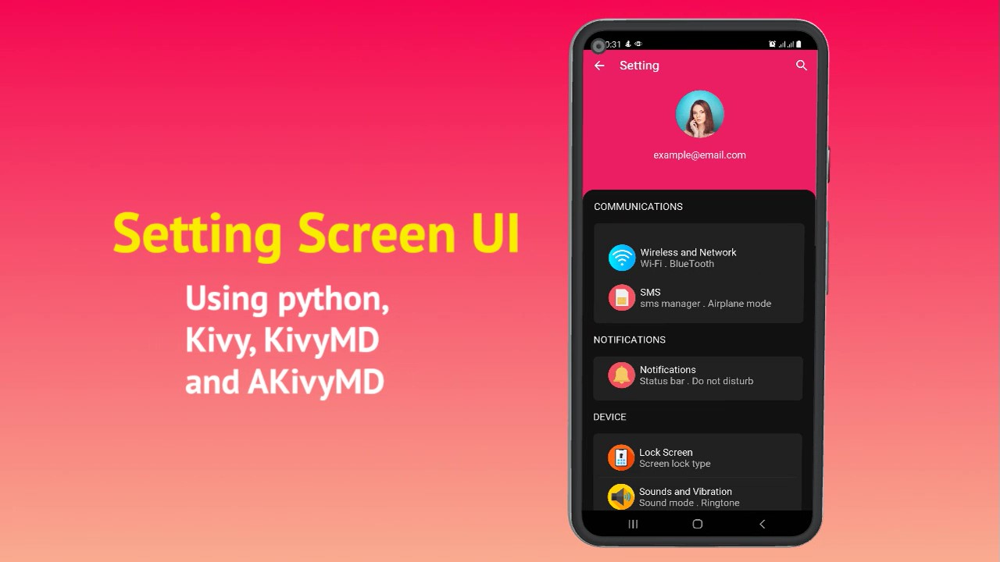
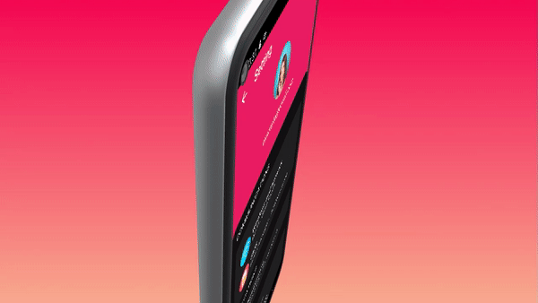

# Kivy-KivyMD-and-AKivyMD-Setting-Screen-UI

A clear and a simple setting screen UI with colorful custom icons and Organized design and change theme option

## requirements

`pip install -r requirements.txt`  

## Icons
[flat icon website](https://www.flaticon.com/)
## Video
[watch on YouTube ](https://youtu.be/PHoLyrxL_bU)

 
  
   
    

